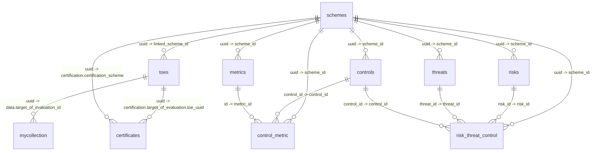

# CCM Manager Database Schema

This document describes the MongoDB schema currently used by the CCM Manager API.
It is based on the active collection handles in `db.py` and the read/write paths in
the service layer.

## Source Of Truth

- Database engine: MongoDB, configured in `docker-compose.yml` as `mongo:4.4`.
- Connection: `MONGO_URI`, default `mongodb://mongo:27017/`.
- Database name: `MONGO_DB`, default `mydatabase`.
- Collection handles are defined in `CCM_Manager_API/db.py`.
- MongoDB does not enforce this schema or the relations below. Relations are
  application-level references stored as IDs inside documents.
- No explicit index or unique constraint creation was found in the current code,
  apart from MongoDB's automatic `_id` index.

## Collections At A Glance

| Collection | Main purpose | Main key used by code |
| --- | --- | --- |
| `schemes` | Certification scheme master records | `uuid` |
| `toes` | Target of Evaluation records | `uuid` |
| `certificates` | Issued/withdrawn certificates | `certification.certification_id` |
| `metrics` | Compliance metrics | `id` |
| `risks` | Risk catalogue entries | `risk_id` |
| `threats` | Threat catalogue entries | `threat_id` |
| `controls` | Control/catalogue entries | `control_id`, or `{oscal_id, metric_id}` during scheme upload |
| `control_metric` | Control-to-metric mapping records | `scheme_id`, `control_id`, `metric_id` |
| `risk_threat_control` | Risk-threat-control triplet records | `scheme_id`, `risk_id`, `threat_id`, `control_id` |
| `mycollection` | Generic artifact store used by most artifact workflows | Flexible |
| `collection` | Separate generic collection written through `db.collection` | Flexible |

Additional legacy/standalone helper code can also use `vex_entries` and
`counters`; see the "Additional Collections" section.

## Relationship Overview



## Primary Collections

### `schemes`

Stores one master document per uploaded certification scheme.

Typical document:

```json
{
  "type": "certification_scheme",
  "uuid": "AI_CLOUD_UC_v2",
  "content": {
    "id": "AI_CLOUD_UC_v2",
    "compliance_metrics": [],
    "certifiable_standards_mapping": [],
    "boundary_conditions": {},
    "risk_catalogue": [],
    "productProfile": {},
    "controls": [],
    "profile": {},
    "catalog": {}
  },
  "ledger_hash": "string",
  "timestamp": "2026-06-08T12:00:00.000000"
}
```

Relations:

- `schemes.uuid` is referenced by `metrics.scheme_id`, `risks.scheme_id`,
  `threats.scheme_id`, `controls.scheme_id`, `control_metric.scheme_id`,
  `risk_threat_control.scheme_id`, and `toes.linked_scheme_id`.
- Certificates reference the scheme through
  `certificates.certification.certification_scheme`.

Notes:

- Upload uses `update_one({"uuid": scheme_id}, ..., upsert=True)`.
- Deleting a scheme only removes the `schemes` document. The code does not
  cascade-delete related metrics, risks, threats, controls, mappings, ToEs, or
  certificates.

### `toes`

Stores Target of Evaluation descriptors submitted to `/upload_toe_descriptor`.

Typical document:

```json
{
  "type": "target_of_evaluation",
  "uuid": "toe-uuid",
  "name": "ToE name",
  "content": {
    "component": {
      "component-definition": {
        "components": []
      }
    },
    "attached_boms": {}
  },
  "linked_scheme_id": "AI_CLOUD_UC_v2",
  "timestamp": "2026-06-08T12:00:00.000000"
}
```

Relations:

- `toes.linked_scheme_id` -> `schemes.uuid`.
- `toes.uuid` -> `certificates.certification.target_of_evaluation.toe_uuid`.
- Assessment results stored in `mycollection` reference a ToE through
  `data.target_of_evaluation_id`.
- During ToE upload, component `links[].href` values are cleaned and matched
  against `mycollection.uuid`, `mycollection.serialNumber`, `mycollection.filename`,
  or `mycollection._id`. Matching BOM documents are embedded under
  `content.attached_boms`.

### `certificates`

Stores certificate documents generated from compliant assessment results.

Typical document:

```json
{
  "certification": {
    "certification_id": "certificate-uuid",
    "name": "Certificate for ToE name",
    "version": "1.0",
    "certification_scheme": "AI_CLOUD_UC_v2",
    "certifying_body": {},
    "applicant": {},
    "target_of_evaluation": {
      "toe_name": "ToE name",
      "toe_uuid": "toe-uuid",
      "description": "Automated Certification via CCM Manager"
    },
    "certification_scope": {},
    "assessment": {
      "assessment_id": "assessment-uuid",
      "assessment_date": "2026-06-08",
      "assessment_result": "PASS",
      "evidence": ["evidence-uuid"]
    },
    "certification_decision": {
      "decision_date": "2026-06-08",
      "decision_status": "Granted",
      "certification_level": "Basic",
      "validity_period": {
        "start_date": "2026-06-08",
        "end_date": "2027-06-08"
      }
    },
    "certificate_issuance": {},
    "history": []
  },
  "ledger_hash": "string"
}
```

Relations:

- `certification.certification_scheme` -> `schemes.uuid`.
- `certification.target_of_evaluation.toe_uuid` -> `toes.uuid`.
- `certification.assessment.assessment_id` -> assessment result
  `mycollection.data.id` when `mycollection.type` is `assessment_result`.
- `certification.assessment.evidence[]` -> evidence IDs stored in the separate
  `collection` collection by `/evidence`, if that endpoint is used.

Notes:

- Withdrawal updates
  `certification.certification_decision.decision_status` to `Withdrawn` and pushes
  a new item into `certification.history`.

### `metrics`

Stores compliance metrics from uploaded schemes or the startup AI catalogue.

Typical document:

```json
{
  "id": "MetricId_1.0",
  "name": "Metric name",
  "description": "Metric description",
  "version": "1.0",
  "information_need": "string",
  "implementation_evidence": "string",
  "frequency": 1,
  "data_source_type": "VirtualMachine",
  "reporting_format": "Boolean",
  "target_values": {
    "target_value_scale": "Boolean",
    "target_value": "true"
  },
  "associated_control": {
    "associated_control_framework": "EUCS",
    "associated_control_category": "",
    "associated_control_requirement": "OPS-05.3H"
  },
  "mapped_risks": ["risk-id"],
  "scheme_id": "AI_CLOUD_UC_v2",
  "timestamp": "2026-06-08T12:00:00.000000"
}
```

Relations:

- `metrics.scheme_id` -> `schemes.uuid`.
- `metrics.id` -> `control_metric.metric_id`.
- `metrics.mapped_risks[]` -> `risks.risk_id`.
- `metrics.associated_control.associated_control_requirement` is used to derive
  `control_metric.control_id` when explicit control-metric mappings are not
  supplied.

### `risks`

Stores risk catalogue entries from uploaded schemes or the startup AI catalogue.

Typical document:

```json
{
  "risk_id": "risk-id",
  "risk_name": "Risk name",
  "risk_details": "Risk description",
  "risk_category": "string",
  "associated_framework": "string",
  "mapped_threats": [
    {
      "threat_id": "threat-id",
      "name": "Threat name"
    }
  ],
  "mapped_metrics": [
    {
      "metric_id": "MetricId_1.0",
      "impact": "string"
    }
  ],
  "scheme_id": "AI_CLOUD_UC_v2",
  "timestamp": "2026-06-08T12:00:00.000000"
}
```

Relations:

- `risks.scheme_id` -> `schemes.uuid`.
- `risks.risk_id` -> `risk_threat_control.risk_id`.
- `risks.mapped_threats[].threat_id` -> `threats.threat_id`.
- `risks.mapped_metrics[].metric_id` -> `metrics.id`.

### `threats`

Stores threat entries derived from `risk_catalogue[].mapped_threats`.

Typical document:

```json
{
  "threat_id": "threat-id",
  "name": "Threat name",
  "associated_risk_id": "risk-id",
  "scheme_id": "AI_CLOUD_UC_v2",
  "timestamp": "2026-06-08T12:00:00.000000"
}
```

Relations:

- `threats.scheme_id` -> `schemes.uuid`.
- `threats.associated_risk_id` -> `risks.risk_id`.
- `threats.threat_id` -> `risk_threat_control.threat_id`.

### `controls`

Stores controls from an uploaded scheme's `controls` list and from the startup
AI catalogue's `certifiable_standards_mapping`.

Typical document from scheme upload:

```json
{
  "control_id": "OPS-05.3H",
  "name": "Control name",
  "description": "Control description",
  "metric_id": "MetricId_1.0",
  "oscal_id": "eucs-10.OPS-05_level_High_req.3H",
  "scheme_id": "AI_CLOUD_UC_v2",
  "timestamp": "2026-06-08T12:00:00.000000"
}
```

Typical document from catalogue initialization:

```json
{
  "metric_id": "MetricId_1.0",
  "standard": "EUCS",
  "control_id": "OPS-05.3H",
  "description": "Control description"
}
```

Relations:

- `controls.scheme_id` -> `schemes.uuid` when present.
- `controls.metric_id` -> `metrics.id`.
- `controls.control_id` -> `control_metric.control_id` and
  `risk_threat_control.control_id`.
- `controls.oscal_id` links the control to the OSCAL control identifier.

Notes:

- Scheme upload upserts controls by `{oscal_id, metric_id}`.
- The CRUD endpoints fetch/update controls by `control_id`, or by
  `associated_control_requirement`/`id` when resolving incoming keys.
- Because both catalogue initialization and scheme upload write here, the
  collection can contain mixed document shapes.

### `control_metric`

Stores explicit or derived control-to-metric mappings for each scheme.

Typical document:

```json
{
  "scheme_id": "AI_CLOUD_UC_v2",
  "control_id": "OPS-05.3H",
  "metric_id": "MetricId_1.0",
  "timestamp": "2026-06-08T12:00:00.000000"
}
```

Relations:

- `control_metric.scheme_id` -> `schemes.uuid`.
- `control_metric.control_id` -> `controls.control_id`.
- `control_metric.metric_id` -> `metrics.id`.

Notes:

- Existing mappings for a scheme are deleted before replacement.
- If the upload payload does not contain `control_metric_mappings`, these records
  are derived from `metrics[].associated_control.associated_control_requirement`.

### `risk_threat_control`

Stores explicit or derived risk-threat-control triplets for each scheme.

Typical document:

```json
{
  "scheme_id": "AI_CLOUD_UC_v2",
  "risk_id": "risk-id",
  "threat_id": "threat-id",
  "control_id": "OPS-05.3H",
  "timestamp": "2026-06-08T12:00:00.000000"
}
```

Relations:

- `risk_threat_control.scheme_id` -> `schemes.uuid`.
- `risk_threat_control.risk_id` -> `risks.risk_id`.
- `risk_threat_control.threat_id` -> `threats.threat_id`.
- `risk_threat_control.control_id` -> `controls.control_id`.

Notes:

- Existing triplets for a scheme are deleted before replacement.
- If the upload payload does not contain `risk_threat_control_mappings`, triplets
  are derived from risk-to-metric and metric-to-control data.
- These records are intended to be targeted triplets, not a full Cartesian
  product of all risks, threats, and controls.

## Generic Artifact Collections

### `mycollection`

`db.py` exposes this as `collection = db.mycollection`. Most artifact services use
this collection. It is intentionally flexible and stores several document families.

Known shapes include:

```json
{
  "_id": "hashed-ip",
  "algorithm_sbom": {},
  "certificate_sbom": {},
  "protocol_sbom": {}
}
```

```json
{
  "sbom_filepath": "/path/to/sbom.json",
  "vulnerabilities": {}
}
```

```json
{
  "bomFormat": "CycloneDX",
  "specVersion": "1.4",
  "serialNumber": "urn:uuid:...",
  "version": 1,
  "metadata": {},
  "services": []
}
```

```json
{
  "uuid": "oscal-doc-uuid",
  "hash": "sha256",
  "oscal_type": "component-definition",
  "content": {}
}
```

```json
{
  "type": "ccm_ledger",
  "headers": {
    "uuid": "ledger-entry-uuid",
    "hash": "sha256",
    "timestamp": "2026-06-08T12:00:00.000000"
  },
  "oscal_component": {
    "ref": "ledger-entry-uuid",
    "component-definition": {}
  }
}
```

```json
{
  "type": "assessment_result",
  "data": {
    "id": "assessment-uuid",
    "target_of_evaluation_id": "toe-uuid",
    "metric_id": "MetricId_1.0",
    "evidence_id": "evidence-uuid",
    "compliant": true,
    "ledger_hash": "string"
  },
  "timestamp": "2026-06-08T12:00:00.000000"
}
```

```json
{
  "channel": "artifact",
  "smartContract": "artifactsc",
  "key": "test",
  "data": {}
}
```

```json
{
  "filename": "file.json",
  "hash": "string",
  "content": {},
  "timestamp": 1780910400.0,
  "note": "Saved due to /create endpoint failure"
}
```

Relations:

- Assessment result `data.target_of_evaluation_id` -> `toes.uuid`.
- Assessment result `data.metric_id` -> `metrics.id`.
- Assessment result `data.evidence_id` can match evidence `data.id` in the
  separate `collection` collection.
- ToE retrieval searches this collection for linked artifacts by `uuid`,
  `serialNumber`, `filename`, `_id`, `target_of_evaluation_id`, and certificate
  target references.

### `collection`

Some functions use `db.collection` directly instead of the `collection` handle from
`db.py`. In PyMongo that writes to a MongoDB collection literally named
`collection`, separate from `mycollection`.

Known shapes include:

```json
{
  "type": "evidence",
  "data": {
    "timestamp": "string",
    "toolId": "string",
    "raw": {},
    "resource": {},
    "id": "evidence-uuid"
  }
}
```

```json
{
  "...": "arbitrary payload posted to /data"
}
```

Relations:

- Evidence `data.id` can be referenced by assessment results and generated
  certificates.

## Additional Collections

These are present in service/helper classes but are not part of the main `db.py`
collection list.

### `vex_entries`

The `SBOMGenerator` helper uses `MONGO_COLLECTION`, defaulting to `vex_entries`,
and `MONGO_DB`, defaulting to `sbom_db` inside that class. The active Flask route
uses `sbom_workflow.py` and stores the same shape in `mycollection`.

Typical document:

```json
{
  "sbom_filepath": "/path/to/sbom.json",
  "vulnerabilities": {}
}
```

### `counters`

`ChainTriggerService` expects a counters collection for sequential artifact keys.
This class is not wired through the current Flask app initialization, but the
expected document shape is:

```json
{
  "_id": "unique_key_counter",
  "seq": 1
}
```

## Referential Integrity Notes

- Relations are not enforced by MongoDB. The API checks some relations before
  writing, for example ToE upload validates `linked_scheme_id`, and assessment
  processing validates both ToE and linked scheme existence.
- Mapping collections can contain orphan IDs if written directly through MongoDB
  or through the mapping replacement endpoints with invalid IDs.
- Entity upserts for `metrics`, `risks`, and `threats` use only `id`, `risk_id`,
  and `threat_id`, not compound `{scheme_id, id}` keys. Reusing the same entity ID
  across schemes can overwrite fields from a previous scheme.
- `controls` has mixed key behavior: scheme upload uses `{oscal_id, metric_id}`,
  while CRUD lookup uses `control_id`.
- Scheme deletion does not cascade to related collections.

## Main Code References

- `CCM_Manager_API/db.py`
- `CCM_Manager_API/config.py`
- `CCM_Manager_API/docker-compose.yml`
- `CCM_Manager_API/services/certification_scheme_service.py`
- `CCM_Manager_API/services/toe_service.py`
- `CCM_Manager_API/services/assessment_service.py`
- `CCM_Manager_API/services/certificate_service.py`
- `CCM_Manager_API/services/catalogue_service.py`
- `CCM_Manager_API/services/artifact_service.py`
- `CCM_Manager_API/services/cbom_workflow.py`
- `CCM_Manager_API/services/sbom_workflow.py`
